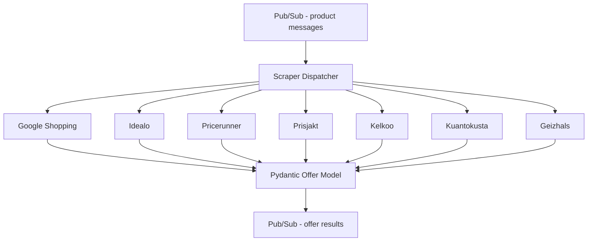

# sherlock_offer_scrapers

Multi-source async price scraping system. Fetches product offers from 7+ European price comparison sources (Google Shopping, Idealo, Pricerunner, Prisjakt, Kelkoo, Kuantokusta, Geizhals) with typed Python models and structured logging.

Part of the [Panprices](https://panprices.com) price intelligence platform.

## Architecture

## What it does

Given a product GTIN (barcode), the system queries multiple price comparison sources across European markets to find all available offers. Each source has its own scraper module that handles:

- Source-specific HTML parsing or API integration
- Price extraction and currency normalization
- Retailer identification and URL resolution
- Offer deduplication across sources

All scrapers produce a common `Offer` model (Pydantic) ensuring type safety and consistent data across sources.

## Key technical decisions

- **Each scraper as an independent Cloud Function** -- deployed and scaled independently, failure in one source doesn't affect others
- **Pydantic models throughout** -- typed offer/product models catch data quality issues at parse time rather than downstream
- **Proxy rotation per source** -- different sources require different proxy strategies (datacenter vs. residential, country-specific exit nodes)
- **Structured logging with structlog** -- every request and response is logged with source, country, status, and timing for debugging and monitoring
- **Parallel CI/CD via Cloud Build** -- each scraper module has its own build trigger for independent deployment

## Stack

Python, Pydantic, BeautifulSoup, Cloud Functions, Cloud Pub/Sub, Cloud Build, structlog
