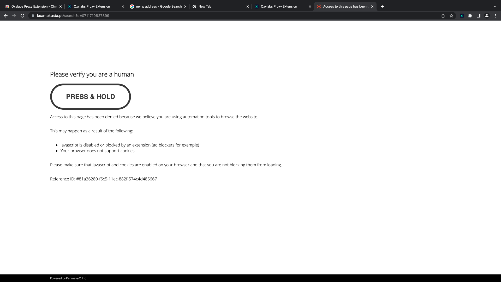
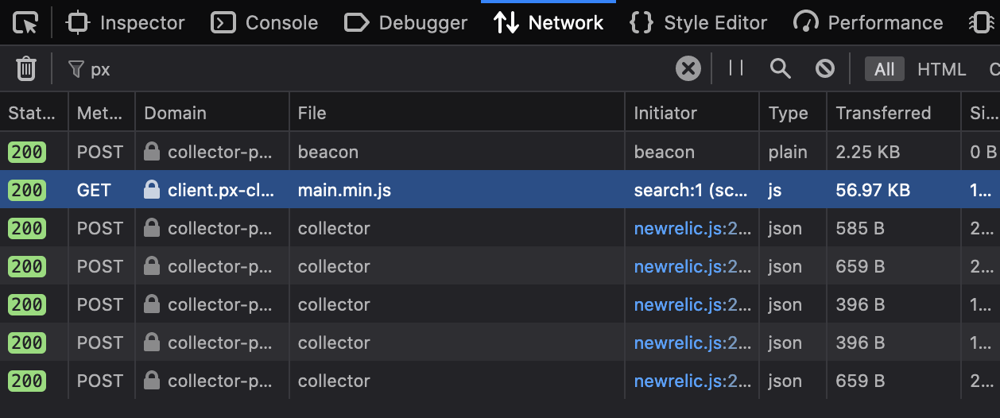
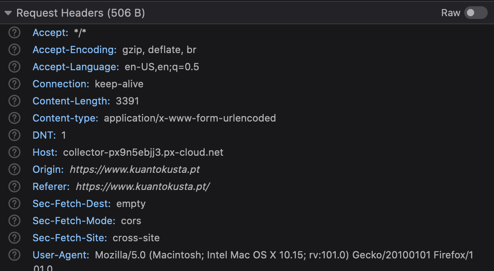
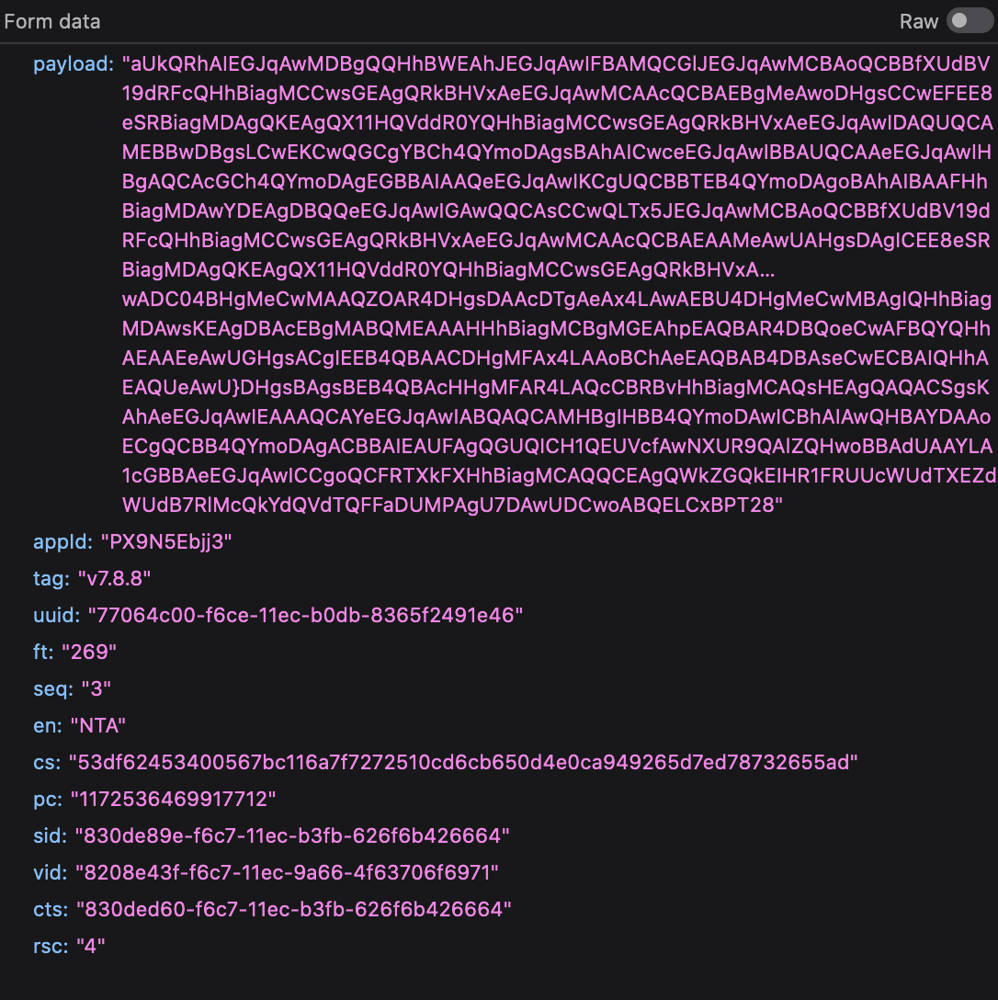

# What happens

After a certain number of request, kuanto kusta starts replying with `403` response codes. If we open the page in the
browser we see the following web page: 

It says on this webpage that there might be 2 reasons for why we were identified as bots: 
- no cookies
- no javascript

If we take a look at the bottom of the page, we can find the name of the service providing kuantokusta with bot 
detection capabilities: [PerimeterX](https://www.perimeterx.com/index1/). [This](https://www.perimeterx.com/products/bot-defender/)
is the landing page for the bot detection tool. 

# Further investigation

There is no obvious cookie that says I am validated as a non-bot at least at first sight. 

Looking at the network requests I was able to find a beacon request to 
[collector-px](https://collector-px9n5ebjj3.px-cloud.net/api/v2/collector/beacon). It is a plain empty file, so it is 
the thing that detects that javascript is running on the browser, probably.

We can find all the requests sent to their service if we filter by "px":

Looking at the header of one of these requests, no authentication seems to be used, so the API should be public (if we 
specify the right origin when we make requests to it). 

The data it sends is however encrypted, so it would be difficult to fake that data, unless we send the exact same string 
every time (which is kind of suspect I guess): 

# Possible solutions

## Sending cookies to kuantokusta

We could export the cookies we have in a normal browsing session and process them to send them back with every request
our bot makes. The **issue** is that this technique seems too rudimental to work. Most probably the cookies are
dynamically generated.

## Headless browsing 

This is always a possibility obviously, but this would take much longer times than simply requesting the html
and scraping it. 

## Using their service on one of our websites and try to break it there

If we pay for their service, then we have much more access to the way this bot detection tool works and we can see what
data it receives to make its decisions. Based on that we could reverse engineer their methods to try to break them. 

## Spend some time to act as a dumb bot, but in the browser

One way to understand what this tool is looking at is to perform the exact same operations that a bot would do: 
- search for GTIN
- open the first page
- open all possible offers to check for the real retailer name

We should do all this while observing how the headers and cookies of our requests change over time. With that 
understanding we might be able to replicate the same behaviour with the bot. 

The **problem** here is that if we get blocked acting as a dumb bot in the browser then it becomes much more difficult 
to pass by this system when we are using the actual bot. This would be a signal that their policy is quite aggressive. 
